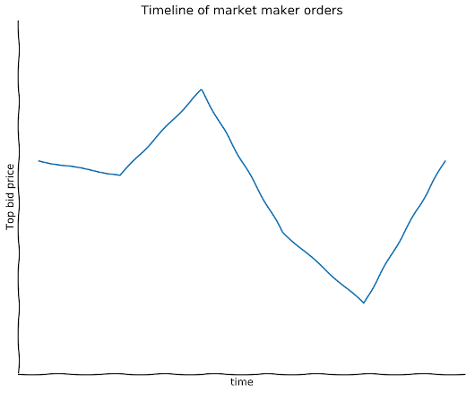
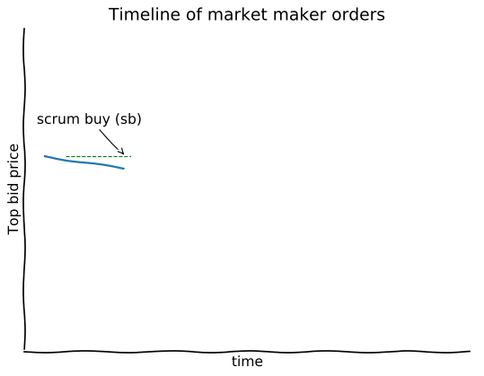
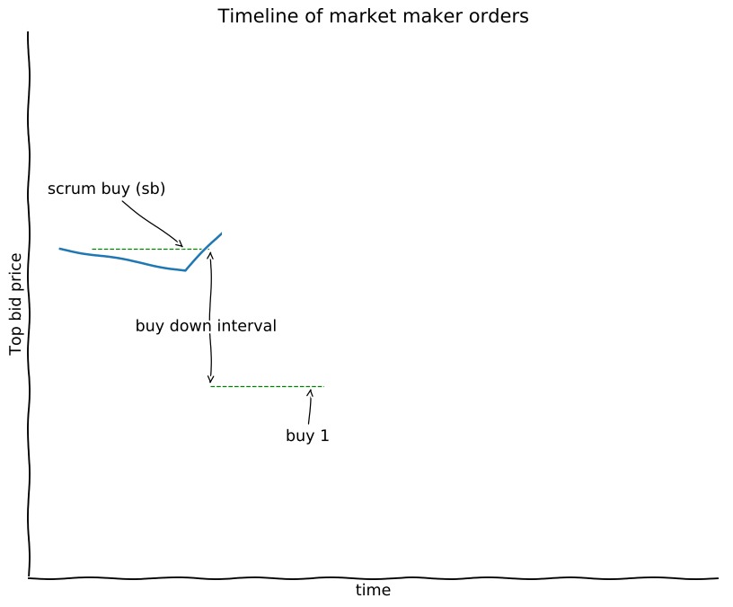

# makerbot - a simple market maker bot
The makerbot is a cryptocurrency market maker bot that is easy understand and customize. Its goal is to create a useful practical tool to start on algorithm trading of digital assets, the bot should be provide a skeleton for traders wanting to perform the market maker strategy to build upon, a side goal is to offer a possible profitable setup for trading at Nash out-of-the-box, so users can learn by doing.

**Requires Python 3**

**This software is beta,  works as intended but several improvements are expected in near term**

## Quick install guide
 Install Python 3 package manager if not available:

* On Ubuntu/Debian:``$ sudo apt install python3-pip``
* On Fedora/CentOS:``$ sudo dnf install python3-pip``
* On Mac OSX, first install homebrew than Python 3:
	* ``$ /usr/bin/ruby -e "$(curl -fsSL https://raw.githubusercontent.com/Homebrew/install/master/install)"``
	* ``$ brew install python3``

* Using pip install the bot
``$ pip3 install --user nash-makerbot``
* Get the provided example configuration file
``$ wget https://gitlab.com/nash-io-public/nash-makerbot/raw/master/default.ini``
* Start the bot
``$ makerbot start eth_usdc --config=default.ini``

## How it works
This bot implements a simple symmetric market maker algorithm. It is based on the simple idea that there is an intrinsic volatility on the market (as shown in the image bellow), it will trade around a fixed spread.

 When the bot starts it watches the order book from the chosen market until it gets `min_history_points` updates or spend a maximum time of `max_loading_time`. The order book is stored in a `OrderBookSeries` object that is a `NamedTuple`  with two fields wrapping around two `NumPy.Array` , one `obs.t` that contains the time in which each snapshot of the order book was recorded and another `obs.data` that contains the snapshots of the order book.

1. The bot will place the first buy, the **scrum buy**. It is defined on `setup_scrum_buy`.

2. If the price goes up, the scrum buy will be executed. In that case the bot will place a new buy order **buy 1** with a price `buy_down_interval` lower than the microprice.

3. At the same time as placing buy 1 a sell order corresponding to the scrum buy **sell (sb)** will be placed at a price `straddle` higher than the buy 1. The bot has than became a market maker as it has both buy and sell orders open in the limit order book.

4. As the volatility of the market continues it will continue to place buy and sell orders.

Users are invited to take a special look are expand the functions `should_rebuy`, `should_place_buy`, `get_buy_order` and `size_order`.

* `should_rebuy` determines if the bot should cancel the current open buy order, this is needed for example if the spread between the lowest sell and the current buy are too big or if the market has moved up and the probability of the buy order executing is now low.

* `should_place_buy` try to look at market microstructure and determine if it is a good moment to place a new buy order.

* `get_buy_order` determine the price of the buy orders.

* `size_order` determine the amount of the buy orders.

### Todo
- [ ] refactor to make it more pythonic and clean
- [ ] add testing everywhere
- [ ] generalize for custom strategy
- [ ] create Web UI
- [ ] add historical data collection
- [ ] allow to simulate a strategy and track expected performance.

### LICENSE
This software uses the MIT license, you are free to use for profit or include it on other closed source projects.
