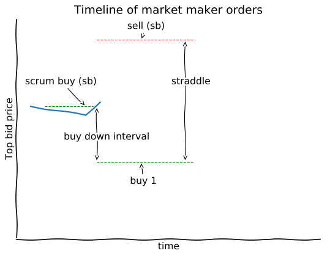
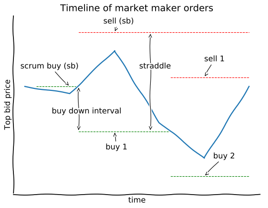

Makerbot: A simple market-maker bot
===================================

The makerbot is a cryptocurrency market-maker bot that is easy to understand and customize. Its goal is to create a useful practical tool to begin trading digital assets algorithmically. The bot provides a skeleton to build upon for traders wanting to perform market-maker strategies. Its default configuration should allow for trading on Nash out of the box, so users can start quickly.

**Requires Python 3**

**This software is a beta. It works as intended but several improvements are expected in the near term.**

Quick install guide
-------------------

Install a Python 3 package manager if you do not already have one:

-  On Ubuntu/Debian: ``$ sudo apt install python3-pip``
-  On Fedora/CentOS: ``$ sudo dnf install python3-pip``
-  On Mac OSX, first install Homebrew, then Python 3:

   -  ``$ /usr/bin/ruby -e "$(curl -fsSL https://raw.githubusercontent.com/Homebrew/install/master/install)"``
   -  ``$ brew install python3``

-  Using pip, install the bot: ``$ pip3 install --user nash-makerbot``
-  Get the example configuration file provided here:
   ``$ wget https://gitlab.com/nash-io-public/nash-makerbot/raw/master/default.ini``
-  Start the bot: ``$ makerbot start eth_usdc --config=default.ini``

How it works
------------

This bot implements a simple symmetric market-maker algorithm. It is based on the idea that there is intrinsic volatility within a market, as shown in the image below, and will trade within a fixed spread.

.. figure:: docs/fig/0_start.png
   :alt: Market volatility

   Market volatility

When the bot starts, it watches the order book for the chosen market until it gets ``min_history_points`` updates or a maximum time of ``max_loading_time`` passes. The order book is stored in the ``OrderBookSeries`` object. This is a ``NamedTuple`` with two fields wrapping around two ``NumPy.Array``s, one ``obs.t`` that contains the time in which each snapshot of the order book was recorded and another ``obs.data`` that contains the snapshots of the order book.

1. The bot will place the first buy order, the **scrum buy**. It is defined as ``setup_scrum_buy``.

.. figure:: docs/fig/1_scrum_buy.png
   :alt: Scrum buy

   Scrum buy

2. If the price goes up, the **scrum buy** order will be filled. In that case, the bot will place a new buy order **buy 1** with a price ``buy_down_interval`` lower than the microprice.

.. figure:: docs/fig/2_buy_1.png

3. At the same time as placing **buy 1**, a sell order corresponding to the scrum buy **sell (sb)** will be placed at a price ``straddle`` higher than **buy 1**. The bot has now become a market maker, since it has both buy and sell orders open in the limit order book.

4. As the market continues to move, the bot will place buy and sell orders according to its volatility. For each new buy order, a corresponding sell order will be placed.

Users are invited to take a closer look at the functions the bot follows when placing its orders: ``should_rebuy``, ``should_place_buy``, ``get_buy_order`` and ``size_order``.

-  ``should_rebuy`` determines if the bot should cancel the current open buy order. This is needed, for example, if the spread between the lowest sell and the current buy is too big or if the market has moved up and the probability of the buy order executing is now low.

-  ``should_place_buy`` looks at market microstructure and determines if now is a good moment to place a new buy order.

-  ``get_buy_order`` determines the price of buy orders.

-  ``size_order`` determines the size of buy orders.

Todo
~~~~

-  [ ] Refactor to make code more pythonic and clean
-  [ ] Add testing everywhere
-  [ ] Generalize for custom strategy
-  [ ] Create web UI
-  [ ] Add historical data collection
-  [ ] Allow simulation of a strategy and track expected performance.

License
~~~~~~~

This software uses the MIT License. You are free to use it for profit or
include it in other closed-source projects.
